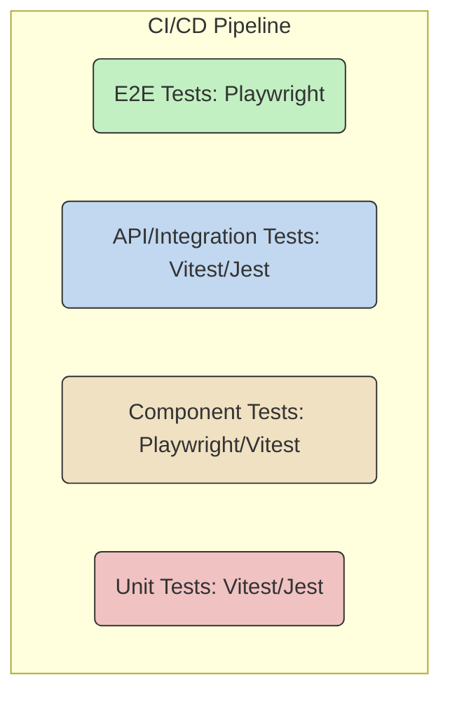

# System-Level Test Design & Strategy

**Project:** Shift & KPI Reporting Solution
**Author:** Murat, Master Test Architect
**Date:** 2025-12-06
**Version:** 1.0

---

## 1. Introduction

This document provides a comprehensive, system-level test design and strategy for the **Shift & KPI Reporting Solution**. Its purpose is to identify architectural risks, define a multi-layered testing approach, and establish clear quality gates before development begins.

This analysis is based on the following documents:
-   `docs/ux-design-specification.md`
-   `docs/architecture.md`
-   `docs/epics.md`

The strategy herein is derived from the Test Engineering Architect's internal knowledge base on risk governance, NFR validation, and test quality.

---

## 2. Testability Assessment

A review of the proposed architecture (`docs/architecture.md`) was conducted to evaluate its testability.

### 2.1. Controllability

**Assessment:** **PASS**

**Rationale:** The architecture demonstrates good controllability.

-   **State Control:** The combination of a NestJS backend and direct Supabase access provides multiple avenues for state manipulation.
    -   **API Seeding:** The NestJS API (`POST /api/reports`, `POST /api/users`) can be used in test setups to create a known state (e.g., pre-existing reports, specific user roles). This is the preferred method for E2E and integration tests.
    -   **Database Seeding:** For lower-level tests, direct database seeding via `supabase-js` with a `service_role` key is possible, allowing for rapid and precise test data setup.
-   **Dependency Mocking:**
    -   The NestJS backend's use of Dependency Injection is a significant advantage, allowing services (like notification clients or external payment gateways, if any arise) to be easily mocked at the integration test level.
    -   On the frontend, API calls made via `services/api.ts` can be intercepted and mocked using tools like Playwright's network interception (`page.route()`) for E2E tests, isolating the frontend from the backend.

### 2.2. Observability

**Assessment:** **PASS with Recommendations**

**Rationale:** The foundation for good observability is present, but requires disciplined implementation.

-   **System State Inspection:**
    -   **Backend:** The NestJS backend, being stateless, relies on structured logging. Epic E-6 (S-6.2) rightly calls for this. It is critical that logs include correlation IDs (e.g., `x-trace-id`) to trace a request from the frontend through the API to the database.
    -   **Frontend:** State management hooks (`useShiftReport.ts`) provide a clear window into the UI's state, which is beneficial for component-level testing.
    -   **Database:** Direct access to the Supabase PostgreSQL database allows for clear validation of the final state after a test has run.
-   **NFR Validation:** The architecture supports NFR validation. Performance metrics can be gathered via backend API response times (`Server-Timing` headers) and frontend Core Web Vitals. Security audit logs can be implemented in the `incidents` or a dedicated `audit_log` table.

**Recommendations:**
1.  **Implement Structured Logging Early:** Ensure S-6.2 is a priority. All API logs must be JSON-formatted and include a `trace_id`.
2.  **Expose Health Checks:** The NestJS backend should expose a `/api/health` endpoint that checks the status of the database connection and other critical dependencies. This is vital for reliability testing.

### 2.3. Reliability

**Assessment:** **CONCERNS**

**Rationale:** While the architecture allows for reliable testing, several factors introduce potential flakiness if not managed carefully.

-   **Test Isolation:** The biggest risk to reliability is state pollution. While the architecture *allows* for cleanup (via API or DB calls), it does not *enforce* it. Tests that create users or reports can easily conflict when run in parallel.
-   **Deterministic Waits:** The reliance on a distributed system (Frontend -> Backend -> Supabase) means that tests must use deterministic, network-first waits (e.g., `cy.intercept()`, `page.waitForResponse()`) instead of fragile, time-based waits (`cy.wait(1000)`).
-   **Component Coupling:** The frontend components are well-structured, promoting loose coupling and testable boundaries. The backend's modular structure in NestJS also supports this.

**Recommendations:**
1.  **Implement a Test Data Factory/Fixture System:** A core part of Sprint 0 should be creating a fixture system (as described in `test-quality.md`) that handles both the creation and, crucially, the automated teardown of test data (users, reports, etc.).
2.  **Enforce Network-First Patterns:** All E2E and integration tests that involve API calls must wait for the network response, not for an arbitrary amount of time. This must be a pull request review standard.

---

## 3. Risk Assessment & Prioritization

Based on the provided documentation, the following system-level risks have been identified. They are scored based on **Probability (P) × Impact (I)**, where 1=Low, 2=Medium, 3=High.

| Risk ID | Category | Description                                                                                                       | P | I | Score | Mitigation                                                                                                                                |
| :------ | :------- | :---------------------------------------------------------------------------------------------------------------- | :-: | :-: | :---: | :-------------------------------------------------------------------------------------------------------------------------------------- |
| **R-01**  | **SEC**    | **Insufficient RLS Policies:** Incorrect or missing Supabase RLS policies could lead to data leakage between users or roles.        |  2  |  3  | **6**   | **Mitigation:** Comprehensive API-level integration tests for RBAC. Every RLS policy must have a corresponding *failing* test (e.g., Shift Leader attempts to access another's report) to prove it works. |
| **R-02**  | **PERF**   | **Slow KPI Aggregation:** The backend KPI aggregation queries (`/api/dashboard/kpis`) could become slow as `shift_reports` grow, failing the <2s load time requirement (S-4.3). |  3  |  2  | **6**   | **Mitigation:** Implement k6 load tests specifically for the KPI endpoint. Use database indexing on date and key metric columns. Consider pre-calculating KPIs via a Supabase Edge Function. |
| **R-03**  | **DATA**   | **Incomplete Shift Report Submission:** A network failure during the final `POST /api/reports` could result in a partially saved or corrupt report if not handled transactionally. |  2  |  3  | **6**   | **Mitigation:** The entire submission logic in the NestJS backend must be wrapped in a single database transaction to ensure atomicity. Integration tests must validate this. |
| **R-04**  | **TECH**   | **State Management Complexity:** The 9-step shift report form's state is complex. Without robust state management (`useShiftReport.ts`), this could lead to data loss or inconsistencies. |  2  |  2  | **4**   | **Mitigation:** Heavy unit and component testing on the `ShiftReportStepper` and the `useShiftReport` hook, covering edge cases like browser reloads, moving back and forth, etc. |
| **R-05**  | **BUS**    | **Incorrect KPI Calculation:** Ambiguities in business logic could lead to KPIs that are calculated incorrectly, misleading managers. |  2  |  2  | **4**   | **Mitigation:** Backend unit tests for each KPI calculation function with a wide range of input data. Manager UAT is required before deploying the dashboard. |
| **R-06**  | **SEC**    | **Insecure Direct DB Access:** Allowing direct client-side DB access from the frontend, even with RLS, increases the attack surface area compared to a pure API-proxy model. |  1  |  3  | **3**   | **Mitigation:** Strictly limit direct DB access to read-only operations on non-sensitive data. All write operations (especially report submission) MUST go through the backend API. |

---

## 4. Test Strategy & Levels

A multi-layered test strategy will be employed to ensure quality without sacrificing velocity. The strategy is based on the "Test Pyramid" concept.

### 4.1. Test Levels Pyramid

**Proposed Split:**

-   **Unit Tests (40%):**
    -   **Focus:** Pure business logic.
    -   **Examples:** KPI calculation functions, utility functions in `lib/utils.ts`, state management logic in `hooks/useShiftReport.ts`.
    -   **Tool:** Vitest/Jest.

-   **Component Tests (30%):**
    -   **Focus:** Individual React components in isolation.
    -   **Examples:** `KpiCard.tsx` (given different props), `ShiftReportStepper.tsx` (interaction), form components.
    -   **Tool:** Vitest/Jest with React Testing Library, or Playwright's Component Testing feature.

-   **API/Integration Tests (20%):**
    -   **Focus:** Interaction between backend services and the database. API contract validation.
    -   **Examples:** Testing the `/api/reports` submission transaction, validating RLS policies by calling the API as different user roles, checking `/api/dashboard/kpis` output.
    -   **Tool:** Vitest/Jest with `supertest`.

-   **End-to-End (E2E) Tests (10%):**
    -   **Focus:** Critical user journeys through the deployed application.
    -   **Examples:**
        1.  **P0 Flow:** Shift Leader logs in -> Completes all 9 steps of a shift report -> Submits successfully.
        2.  **P0 Flow:** Manager logs in -> Views KPI dashboard -> Filters by date -> Sees updated KPIs.
    -   **Tool:** Playwright.

### 4.2. Test Environment Requirements

-   **Local:** Developers run unit and component tests locally.
-   **CI/Ephemeral:** The CI/CD pipeline will spin up the full environment (Next.js frontend, NestJS backend, Supabase) for each pull request to run the entire test suite (unit, component, integration, E2E).
-   **Staging:** A persistent, production-like environment for UAT and pre-release validation.
-   **Production:** The live environment.

---

## 5. Non-Functional Requirements (NFR) Testing Approach

| NFR Category      | Approach & Tools                                                                                                                                                            |
| :---------------- | :-------------------------------------------------------------------------------------------------------------------------------------------------------------------------- |
| **Security**      | - **Static Analysis:** `npm audit` and Snyk scans in CI to detect vulnerable dependencies.   - **Dynamic Analysis:** Playwright tests to verify auth flows, role access (RBAC), and that sensitive data is not leaked to the client.   - **Penetration Testing:** Recommended post-MVP before handling highly sensitive data. |
| **Performance**   | - **Load Testing:** Use `k6` to run load tests against the NestJS API endpoints, specifically `/api/dashboard/kpis` and `/api/reports`, to ensure the S-4.3 goal of <2s load time is met under concurrent user load.   - **Frontend Performance:** Use Lighthouse in CI to monitor Core Web Vitals (LCP, FID, CLS). |
| **Accessibility** | - **Automated Scanning:** Use `axe-core` integrated with Playwright E2E tests (`@axe-core/playwright`) to catch violations on every run.   - **Manual Testing:** Perform keyboard-only navigation checks and screen reader (NVDA/VoiceOver) walkthroughs for the P0 user flows before major releases. |
| **Reliability**   | - **Chaos Engineering (Post-MVP):** Introduce fault injection in staging to test backend resilience (e.g., simulate database connection failure).   - **Health Checks:** E2E tests will validate that the `/api/health` endpoint is functional and reports a healthy status. |

---

## 6. Test Data Strategy

-   **Factories:** Use a library like `faker-js` to generate realistic and unique test data (users, report details). This is essential for preventing state collisions in parallel test runs.
-   **Seeding:**
    -   For E2E and Integration tests, data will be seeded via API calls within the test setup (`beforeEach` block or test fixture).
    -   This is faster and more reliable than creating data through UI interactions.
-   **Cleanup:**
    -   A global `afterEach` or fixture teardown process is **mandatory**.
    -   It will track all entities created during a test and delete them from the database upon completion, ensuring tests are isolated.

---

## 7. Recommended Tools

-   **Test Runner:** **Vitest** (or Jest). Vitest is recommended for its speed and modern ESM support.
-   **E2E & Integration Testing:** **Playwright**. Its network interception, API testing capabilities, and component testing features make it a powerful all-in-one tool.
-   **Performance Testing:** **k6**. The industry standard for load testing, with clear SLO/SLA definition capabilities.
-   **Accessibility Testing:** **Axe-core**. Integrates directly into the E2E test suite.

---

## 8. Initial Test Cases & Scenarios

This is a high-level list of initial P0 test scenarios to be developed.

| Scenario ID | Test Level | Epic | Test Case Description                                                                                      |
| :---------- | :--------- | :--- | :--------------------------------------------------------------------------------------------------------- |
| **TC-001**  | E2E        | E-3  | **Shift Report Submission:** A 'Shift Leader' can log in, navigate all 9 steps, and submit a complete report. |
| **TC-002**  | E2E        | E-4  | **Manager Dashboard View:** A 'Manager' can log in and view the KPI dashboard with data loaded.              |
| **TC-003**  | API        | E-2  | **Shift Leader Access Control:** An API request from a 'Shift Leader' to view another leader's report fails with a 403 Forbidden. |
| **TC-004**  | API        | E-2  | **Manager Access Control:** An API request from a 'Manager' to view a completed report succeeds.               |
| **TC-005**  | API        | E-3  | **Transactional Submission:** If a database error occurs mid-submission, the entire report is rolled back.     |
| **TC-006**  | Perf (k6)  | E-4  | **Dashboard Load Test:** The `/api/dashboard/kpis` endpoint maintains a p95 response time < 500ms under 50 concurrent users. |
| **TC-007**  | Component  | E-3  | **Stepper Navigation:** The `ShiftReportStepper` component correctly updates its state when moving between steps. |
| **TC-008**  | Unit       | E-4  | **KPI Calculation Logic:** The function for calculating 'Absence %' returns the correct value for various inputs. |

---

## 9. Next Steps & Recommendations

1.  **Implement Foundation:** Prioritize Epic E-1 and E-2 to establish the project structure and auth, which are prerequisites for most tests.
2.  **Create Test Fixtures:** Before writing tests for E-3, build the test data factory and cleanup fixtures for `users` and `shift_reports`.
3.  **CI/CD Integration:** Integrate the test runners (Vitest, Playwright, k6) into the CI/CD pipeline early to provide continuous feedback on every pull request.
4.  **Prioritize Risk Mitigation:** Begin development of the tests outlined in the Risk Assessment (Section 3) to mitigate the highest-impact risks first.
