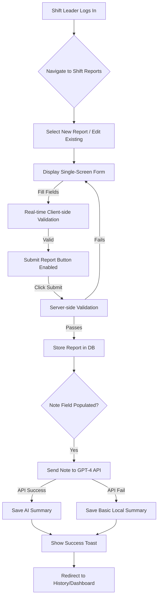
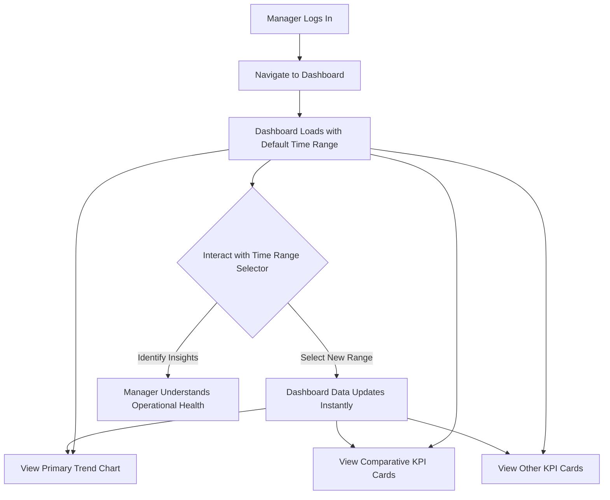
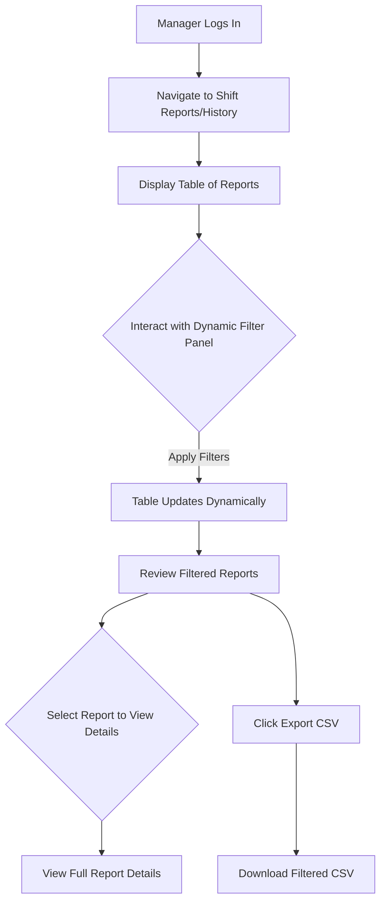

# ibe160 UX Design Specification

_Created on {{date}} by BIP_
_Generated using BMad Method - Create UX Design Workflow v1.0_

---

## Executive Summary

This document outlines the User Experience (UX) and User Interface (UI) design for **ibe160**, a desktop web application designed to replace manual, spreadsheet-based shift reporting. The primary goal is to transform unreliable data into clean, actionable insights, empowering management to make decisions based on facts, not intuition.

The user experience is crafted for two key roles:
*   **Shift Leaders:** Who require a fast, simple, and error-proof way to submit daily reports.
*   **Department Managers:** Who need to visualize performance trends and analyze historical data at a glance.

Every design decision is guided by the core principle of making users feel **empowered, efficient, and productive**.

---

## 1. Design System Foundation

### 1.1 Design System Choice

**Decision:** We will use **Shadcn/UI** as our foundational design system.

**Rationale:**
Shadcn/UI provides a collection of high-quality, accessible, and customizable components built on Radix UI and styled with Tailwind CSS. This approach offers significant advantages:
*   **Flexibility & Uniqueness:** Allows for deep customization, ensuring the application can achieve a unique brand identity without being constrained by a rigid design system.
*   **Performance:** Its "copy-paste" model means only necessary code is included, leading to lean bundle sizes and excellent performance.
*   **Developer Experience:** Aligns with the project's stated technology preferences (Next.js, Tailwind CSS) and offers a great developer experience.
*   **Accessibility:** Inherits strong accessibility features from Radix UI, supporting WCAG compliance.

This choice balances rapid development with the ability to craft a truly custom and efficient user experience, aligning with our goals of making users feel empowered, efficient, and productive.

---

## 2. Core User Experience

### 2.1 Defining Experience

The defining experience of the application is summarized by the user as: **"All the information I need for the shift, I get within minutes."**

This principle applies to both primary user personas:
*   **For Shift Leaders:** The experience of entering data must be exceptionally fast, streamlined, and error-proof.
*   **For Department Managers:** The experience of retrieving insights from dashboards and reports must be immediate and intuitive.

The entire user experience will be optimized for speed and clarity to meet this goal.

### 2.2 Novel UX Patterns

No novel UX patterns are required for this application. The core user journeys—data entry via forms and data consumption via dashboards and tables—will be built using well-established, best-practice UX patterns. The focus will be on executing these standard patterns to an exceptionally high quality, prioritizing usability and efficiency over novelty.

### 2.3 Core Experience Principles

To consistently deliver on the vision of "getting information within minutes" and to ensure users feel empowered, efficient, and productive, the following core experience principles will guide all design decisions:

1.  **Speed is a Feature:** Every interaction, from initial page load to form submission and data retrieval, must be optimized for performance. The system should feel responsive and immediate, minimizing user wait times.
2.  **Clarity Over Clutter:** The user interface will prioritize essential information and actions. Unnecessary elements, complex navigation, or excessive data will be avoided to maintain focus and reduce cognitive load.
3.  **Frictionless Data Entry:** The shift reporting form, as the primary input mechanism, will be designed for maximum efficiency. This includes intuitive layouts, smart defaults, keyboard-friendly navigation, and clear, immediate validation feedback to ensure fast and error-free data submission.
4.  **Insights, Not Just Data:** For managers, dashboards and reports will be designed to provide immediate, actionable insights. Data visualization will be clear and concise, highlighting trends and key performance indicators without requiring extensive analysis.

---

## 3. Visual Foundation

### 3.1 Color System

**Chosen Theme:** Modern & Tech-Forward (Dark)

**Rationale:** This dark theme provides a sleek, professional aesthetic that reduces eye strain, making it ideal for prolonged use in operational environments. The high contrast and vibrant accent color ensure data visualizations and key actions stand out, contributing to a sense of efficiency and empowerment.

**Color Palette:**
*   **Primary Accent:** `#3abff8` (Vibrant Blue - for key actions, interactive elements, and highlighting important data)
*   **App Background (Body):** `#101d23` (The main dark background for the application body)
*   **Content Background:** `#182c34` (Slightly lighter background for cards, modals, and content containers)
*   **Primary Text:** `#ffffff` (For main headings and prominent text)
*   **Secondary Text:** `#8fb9cc` (For labels, helper text, and muted information)
*   **Border / Interactive Border:** `#305869` (For dividers and component borders)
*   **Success:** `#22c55e` (Green - for positive feedback, confirmations)
*   **Error:** `#f43f5e` (Red - for critical alerts, validation errors)
*   **Warning:** `#fbbf24` (Amber - for cautionary messages)
*   **Info:** `#60a5fa` (Softer Blue - for informational messages)

**Typography System:**
To maintain a professional and highly readable interface, we will use a sans-serif font system.
*   **Font Family:** `Inter` (or a similar modern, highly legible sans-serif like `Roboto`, `Segoe UI`) for all text. This ensures consistency and readability across various screen sizes and content types.
*   **Type Scale:** The type scale is based on Tailwind's default naming convention to align with the implementation.
    *   `text-4xl` (2.25rem / 36px): Main page titles (e.g., "Review and Submit Shift Report").
    *   `text-3xl` (1.875rem / 30px): Large headlines.
    *   `text-2xl` (1.5rem / 24px): Section titles within a page.
    *   `text-[22px]` (1.375rem / 22px): Custom size for prominent section headers.
    *   `text-xl` (1.25rem / 20px): Sub-section titles.
    *   `text-lg` (1.125rem / 18px): Emphasized text.
    *   `text-base` (1rem / 16px): Standard body text and form inputs.
    *   `text-sm` (0.875rem / 14px): Secondary text, labels, and navigation items.
    *   `text-xs` (0.75rem / 12px): The smallest text, used for table headers or tertiary info.
*   **Font Weights:** Primarily `Regular (400)`, `Medium (500)`, and `Semi-Bold (600)` to differentiate information without excessive visual noise.

**Spacing and Layout Foundation:**
A consistent 8-pixel grid system will be used for all spacing, padding, and margins. This ensures visual harmony and simplifies responsive design.
*   **Base Unit:** 8px
*   **Spacing Scale:** Multiples of 8 (e.g., 8px, 16px, 24px, 32px, 48px, etc.)
*   **Layout Grid:** A flexible 12-column grid system will be employed for main content areas, adapting to the desktop-only requirement while allowing for future responsiveness. This provides structure and alignment for components.

**Interactive Visualizations:**

- Color Theme Explorer: [ux-color-themes.html](./ux-color-themes.html)

---

## 4. Design Direction

### 4.1 Chosen Design Approach

**Decision:** We will proceed with a hybrid approach, combining elements from Direction #1 and Direction #6, formalized as **Direction #7: REFINED - Sidebar Nav, Insight-Focused**.

**Rationale:** This direction offers a balanced and powerful user experience, aligning perfectly with our core principles:
*   **Structured & Professional:** It adopts the stable and scalable **sidebar navigation** from Direction #1, which is ideal for business applications requiring quick access to different sections.
*   **Clean & Insightful:** It integrates the **insight-focused dashboard** philosophy from Direction #6, prioritizing clear data visualization and trend analysis over raw data density. This ensures managers can "get information within minutes" and feel empowered by immediate insights.
*   **Balanced Layout:** The combination provides a clean yet comprehensive view, reducing visual clutter while ensuring all critical information is accessible.

**Key Characteristics:**
*   **Layout:** Fixed sidebar navigation for primary application sections (Dashboard, Shift Reports, Settings). Main content area is dedicated to data and interactions.
*   **Dashboard Focus:** Emphasizes a primary trend chart (e.g., Orders per Hour Trend) and a few key comparative KPI cards (e.g., Sick Leave vs. Average, Overtime vs. Average) to highlight deviations and insights.
*   **Shift Report Form:** Will maintain a clean, focused layout (similar to Direction #2 or #4) within the main content area, optimized for frictionless data entry.

**Interactive Mockups:**

- Design Direction Showcase Mockups from stich: [shift-report-page1.html](./shif-report-page1.html)
- Design Direction Showcase Mockups from stich: [shift-report-page2.html](./shif-report-page2.html)
- Design Direction Showcase Mockups from stich: [shift-report-page0.html](./shif-report-page0.html)
- Design Direction Showcase Mockups from stich: [shift-report-page3.html](./shif-report-page3.html)
- Design Direction Showcase Mockups from stich: [shift-report-page4.html](./shif-report-page4.html)
- Design Direction Showcase Mockups from stich: [shift-report-page5.html](./shif-report-page5.html)
- Design Direction Showcase Mockups from stich: [shift-report-page6.html](./shif-report-page6.html)
- Design Direction Showcase Mockups from stich: [shift-report-page7.html](./shif-report-page7.html)
- Design Direction Showcase Mockups from stich: [shift-report-page8.html](./shif-report-page8.html)

---

## 5. User Journey Flows

### 5.1 Critical User Paths

#### User Journey: Shift Leader - Create/Update Shift Report

**User Goal:** A Shift Leader needs to quickly and accurately submit their daily operational data, ensuring all required information is captured and validated.

**Chosen Approach:** **Single-Screen Form**
This approach prioritizes efficiency and aligns with the core principle of "Frictionless Data Entry." It allows Shift Leaders to complete their task with minimal clicks and immediate feedback.

**Flow Steps:**

1.  **Entry:**
    *   The Shift Leader navigates to the "Shift Reports" section via the sidebar navigation.
    *   They select "New Report" or choose an existing report to edit from a list (if editing).
    *   The single-screen shift report form is displayed.

2.  **Input:**
    *   The Shift Leader fills out the form fields:
        *   **Basic Info:** Date (defaults to today), Shift (dropdown), Responsible User (auto-filled or selectable).
        *   **Operational Data:** Orders Processed, Staffing Count, Overtime Hours, Sick Leave Percentage.
        *   **Optional:** Free-text note field for incidents, issues, or observations.
    *   **Validation Checks:**
        *   **Real-time (Client-side):** As the user types, immediate inline error messages appear below fields for invalid inputs (e.g., "Value must be between 0-24" for Overtime Hours).
        *   **Required Fields:** Clearly marked and validated.
        *   **Numeric Ranges:** Ensured for relevant fields.
        *   **Date Logic:** Date must be today or earlier.
        *   `ordersByArea`: Must include at least one active area with value ≥ 0.

3.  **Feedback & Submission:**
    *   The "Submit Report" button is enabled only when all required fields are valid.
    *   On clicking "Submit Report":
        *   **Server-side Validation:** A final validation check is performed on the server. If it fails, the user remains on the form with clear messages indicating fields needing correction.
        *   **AI Integration (Note Summarization):** If the note field is populated, the note text is sent to the GPT-4 API.
        *   **AI Summary Storage:** The AI-generated summary is saved to the `noteSummaryAI` field in the database.
        *   **Fallback:** If the GPT-4 API is unavailable, a basic local summary is generated (e.g., "Shift had X absences, Y overtime entries.") to ensure some overview is always available.

4.  **Success:**
    *   Upon successful submission, a **toast notification** appears, confirming that the report was saved.
    *   The user is then redirected to the "View Report History" or the "Dashboard" (to be determined based on user preference/role context).

**Flow Diagram (Simplified):**

#### User Journey: Department Manager - View Dashboard

**User Goal:** A Department Manager needs to quickly view key performance indicators (KPIs) and trends to understand operational health and identify deviations, enabling them to "get information within minutes."

**Chosen Approach:** **Interactive Dashboard with Time Range Selector**
This approach provides managers with immediate, high-level insights while offering the flexibility to adjust the data's time context, aligning with "Insights, Not Just Data" and "Clarity Over Clutter."

**Flow Steps:**

1.  **Entry:**
    *   The Department Manager logs in.
    *   They are automatically directed to the Dashboard (or navigate there via the sidebar).
    *   The Dashboard loads with a default time range (e.g., "Last 30 Days").

2.  **View KPIs and Trends:**
    *   The Dashboard displays:
        *   **Primary Trend Chart:** A prominent line chart showing a critical KPI trend over the selected time period (e.g., "Orders per Hour: Trend & Forecast").
        *   **Comparative KPI Cards:** Key performance indicators (e.g., Sick Leave, Overtime) are shown with their current values and a comparison to an average or previous period (e.g., "↓ 2% vs. Avg"). These cards use color coding (green for positive, red for negative) to highlight performance at a glance.
        *   **Other KPIs:** Additional KPI cards (e.g., Staffing per Area, Total Efficiency per Hour) are displayed, providing a comprehensive overview.

3.  **Interact with Time Range:**
    *   A clear **Time Range Selector** (e.g., a dropdown menu) is available at the top of the dashboard.
    *   The manager can select predefined periods (e.g., "Last 7 Days", "Last 30 Days", "This Quarter") or use a custom date picker to define a specific range.
    *   Upon selection, the dashboard data (charts and KPI cards) updates instantly to reflect the new time context.

4.  **Identify Insights:**
    *   The manager quickly scans the KPI cards and trend charts to identify:
        *   Overall operational health.
        *   Significant deviations or anomalies (e.g., spikes in overtime, drops in orders per hour).
        *   Performance trends over time.

**Flow Diagram (Simplified):**

#### User Journey: Department Manager - View Historical Reports (with filters)

**User Goal:** A Department Manager needs to quickly find and review specific historical shift reports based on various criteria (date, shift, area) and export the filtered data, enabling them to "get information within minutes."

**Chosen Approach:** **Dynamic Filter Panel**
This approach provides a clear, organized, and efficient way for managers to narrow down reports, aligning with "Clarity Over Clutter" and "Insights, Not Just Data."

**Flow Steps:**

1.  **Entry:**
    *   The Department Manager navigates to the "Shift Reports" (or "History") section via the sidebar navigation.
    *   The page loads, displaying a table of all available shift reports (or a default filtered view).

2.  **Apply Filters:**
    *   A **Dynamic Filter Panel** is prominently displayed (e.g., at the top of the table or as a collapsible sidebar section).
    *   The manager interacts with filter controls:
        *   **Date Range Pickers:** For selecting a start and end date.
        *   **Shift Dropdown:** To filter by Morning, Evening, or Night shifts.
        *   **Area Text Input/Dropdown:** To filter reports by specific operational areas.
    *   As filters are applied (either automatically or via an "Apply Filters" button), the table of historical reports updates dynamically to show only the matching entries.
    *   Active filters are clearly indicated.

3.  **Review Reports:**
    *   The filtered reports are displayed in a sortable and paginated table.
    *   Each row provides key summary information (Date, Shift, Area, Orders, Overtime, Sick Leave).
    *   Managers can click on a report to view its full details, including the original note and the AI-generated summary.

4.  **Export Data:**
    *   A clear "Export CSV" button is available.
    *   Clicking this button initiates the download of a CSV file containing all reports currently displayed in the filtered table.
    *   Nested fields (like `ordersByArea`) are flattened into separate columns in the CSV, as specified in `proposal.md`.

**Flow Diagram (Simplified):**

---

## 6. Component Library

### 6.1 Component Strategy

**Foundation:** Our component strategy is built upon **Shadcn/UI**, leveraging its collection of reusable and composable components. This approach allows us to maintain a high degree of customization and performance while ensuring accessibility and a consistent developer experience.

**Standard Components (from Shadcn/UI):**
We will utilize the following standard components, styled to match our "Modern & Tech-Forward (Dark)" theme:
*   **Buttons:** For all actions (Primary, Secondary, Outline, Destructive).
*   **Input Fields:** For text, number, and date entry.
*   **Select/Dropdowns:** For predefined choices like "Shift".
*   **Textarea:** For multi-line text entry, such as the "Notes" field.
*   **Cards:** To act as containers for KPIs, form sections, and other content modules.
*   **Tables:** For displaying historical reports, with features like sorting and pagination.
*   **Toast Notifications:** For providing feedback on actions like successful report submission.
*   **Sidebar Navigation:** The core navigation element of our chosen design direction.
*   **Dialogs/Modals:** For viewing full report details or for confirmation prompts.
*   **Date Pickers:** For selecting date ranges in filters.

**Custom Component Compositions:**
While Shadcn/UI provides the building blocks, we will create specific, reusable compositions for our application's unique needs:
*   **KPI Card with Trend Indicator:** A custom component that combines a Card, a large metric value, a label, and a small trend indicator (e.g., "↑ 15% vs. Avg"). This will be a cornerstone of our "Insights, Not Just Data" principle.
*   **Dynamic Filter Panel:** A layout component that organizes all filter controls (Date Pickers, Selects, etc.) into a cohesive and easy-to-use panel for the historical reports view.
*   **Chart Components:** We will integrate a dedicated charting library (e.g., Recharts, Chart.js) and wrap it in custom components that are styled to match our Shadcn/UI theme, ensuring visual consistency between charts and other UI elements.

This strategy ensures we can build quickly and efficiently while still creating a unique and highly polished user interface that is tailored to the needs of ibe160.

---

## 7. UX Pattern Decisions

### 7.1 Consistency Rules

To ensure a cohesive, predictable, and intuitive user experience across the entire application, the following UX pattern decisions will be consistently applied. These rules are designed to reinforce the core principles of Speed, Clarity, Frictionless Data Entry, and Insights, Not Just Data.

**1. Button Hierarchy:**
*   **Primary Action:** Used for the single, most important action on a screen (e.g., "Submit Report", "Apply Filters").
    *   **Appearance:** Solid background with the Primary Accent color (`#38bdf8`), contrasting text color.
*   **Secondary Action:** Used for less critical or alternative actions (e.g., "Cancel", "Discard", "View Details").
    *   **Appearance:** Dark grey background (`#4b5563`) or an outline style with the Primary Accent color.
*   **Destructive Action:** Used for actions that permanently delete data (e.g., "Delete Report").
    *   **Appearance:** Red outline button. Always triggers a confirmation dialog.

**2. Feedback Patterns:**
*   **Success:**
    *   **Mechanism:** Green toast notification.
    *   **Placement:** Bottom-right of the screen.
    *   **Behavior:** Auto-dismisses after 3-5 seconds.
    *   **Example:** "Report saved successfully."
*   **Error:**
    *   **Form Validation:** Red inline error messages displayed directly below the invalid input field.
    *   **Server Errors/Submission Failures:** Red toast notification that does not auto-dismiss, requiring user interaction to close.
*   **Loading:**
    *   **Page/Data Fetching:** Subtle loading spinner or skeleton loader that mimics the shape of the content being loaded.
    *   **Button Clicks:** The button itself will show a small spinner or change state to indicate processing.

**3. Form Patterns:**
*   **Label Position:** Labels will always be placed directly above their corresponding input fields for optimal readability and scannability.
*   **Required Field Indicator:** An asterisk (`*`) will clearly denote required fields next to their labels.
*   **Validation Timing:** Validation will occur on `blur` (when the user moves focus away from a field) to provide immediate feedback without interrupting typing.
*   **Error Display:** Clear, concise error messages will be displayed in red text directly below the field that failed validation.

**4. Navigation Patterns:**
*   **Active State Indication:** The currently active page in the sidebar navigation will be clearly highlighted with a solid background color (Primary Accent: `#38bdf8`) and bold text, ensuring users always know their location within the application.

**5. Empty State Patterns:**
*   When a table, list, or section has no data to display (e.g., "No reports found" after filtering), a clean, centered message will be shown. This message will include:
    *   An appropriate icon.
    *   A clear headline (e.g., "No Reports Found").
    *   Helpful subtext (e.g., "Try adjusting your filters or creating a new report.").
    *   If applicable, a primary action button (e.g., "Create New Report").

**6. Confirmation Patterns:**
*   **Destructive Actions:** Any action that results in permanent data loss (e.g., deleting a report) will always require explicit user confirmation.
    *   **Mechanism:** A modal dialog will appear, asking for confirmation (e.g., "Are you sure you want to delete this report? This action cannot be undone.").
    *   **Confirmation Button:** The confirmation button within the modal will be styled as a destructive action (red).

---

## 8. Responsive Design & Accessibility

### 8.1 Responsive Strategy

**Desktop-First Approach (MVP):**
For the Minimum Viable Product (MVP), the application will adopt a desktop-first responsive strategy. This means the design and development will primarily focus on optimizing the user experience for various desktop screen sizes and resolutions.
*   **Adaptation:** The layout will fluidly adjust to different desktop window sizes, ensuring content remains readable, components are well-aligned, and interactions are intuitive.
*   **Fixed Sidebar:** The chosen sidebar navigation will remain consistent across desktop sizes.
*   **Future Mobile Responsiveness:** While the underlying `Shadcn/UI` and Tailwind CSS foundation inherently supports mobile responsiveness, full optimization for mobile browsers will be addressed in a post-MVP phase.

### 8.2 Accessibility Strategy

**WCAG 2.1 Level AA Compliance:**
The application will adhere to the Web Content Accessibility Guidelines (WCAG) 2.1 Level AA standards. This commitment ensures that the application is usable by individuals with a wide range of disabilities, promoting inclusivity and broader access.

**Key Accessibility Requirements:**
*   **Keyboard Navigation:** All interactive elements (buttons, form fields, links, navigation items) will be fully operable using only a keyboard, with a logical tab order.
*   **Visible Focus Indicators:** Clear and distinct visual focus indicators will be provided for all interactive elements when navigated via keyboard.
*   **Screen Reader Compatibility:** Semantic HTML will be used, and appropriate ARIA attributes will be implemented to ensure screen readers can accurately interpret and convey content and functionality.
*   **Color Contrast:** Text and interactive elements will meet WCAG 2.1 AA contrast ratios to ensure readability for users with low vision or color blindness.
*   **Alt Text for Images:** All meaningful images will have descriptive alternative text.
*   **Form Labels:** All form input fields will have properly associated and descriptive labels.
*   **Error Identification:** Error messages will be clear, concise, and programmatically associated with the relevant form fields, guiding users on how to correct input.
*   **Touch Target Size:** While MVP is desktop-first, future considerations for mobile will ensure touch targets meet minimum size requirements for easy interaction.
*   **Language Declaration:** The primary language of the page will be declared.

**Testing Strategy:**
Accessibility will be integrated into the testing process, including automated checks (e.g., Lighthouse, axe DevTools) and manual keyboard-only navigation testing. The use of `Shadcn/UI` components, built on Radix UI primitives, provides a strong foundation for accessibility out-of-the-box.

---

## 9. Implementation Guidance

### 9.1 Completion Summary

This UX Design Specification is now complete. Through a collaborative process, we have defined a comprehensive and actionable design blueprint for the `ibe160` application.

**What we created together:**
*   **Design System:** **Shadcn/UI** for a flexible, high-performance, and customizable foundation.
*   **Visual Foundation:** A **Modern & Tech-Forward (Dark)** theme, with a clear color palette, legible typography, and a consistent spacing system.
*   **Design Direction:** A refined **Sidebar Navigation with an Insight-Focused Dashboard**, combining professional structure with clean, actionable data visualization.
*   **User Journeys:** Detailed flows for all critical user paths, including Shift Report submission and Dashboard/History viewing for managers.
*   **UX Patterns:** Consistent rules for buttons, feedback, forms, navigation, and more to ensure a predictable and intuitive user experience.
*   **Responsive & Accessibility Strategy:** A **desktop-first** approach for the MVP, with a commitment to **WCAG 2.1 Level AA** compliance.

**Final Deliverables:**
*   **UX Design Specification:** This document, `ux-design-specification.md`.
*   **Interactive Color Themes:** `ux-color-themes.html`.
*   **Design Direction Mockups:** `ux-design-directions.html`.
*   **Key Screens Showcase:** `final-app-showcase.html`.

This specification provides a solid foundation for designers to create high-fidelity mockups and for developers to implement the application with clear UX guidance and rationale. All design decisions are documented with reasoning to support future development and iteration.

---

## Appendix

### Related Documents

- Product Requirements: `{{prd_file}}`
- Product Brief: `{{brief_file}}`
- Brainstorming: `{{brainstorm_file}}`

### Core Interactive Deliverables

This UX Design Specification was created through visual collaboration:

- **Color Theme Visualizer**: C:\Users\thbje\Documents\IBE160\SG-Ostfold/docs/ux-color-themes.html
  - Interactive HTML showing all color theme options explored
  - Live UI component examples in each theme
  - Side-by-side comparison and semantic color usage

- **Design Direction Mockups**: [ux-design-directions.html](./ux-design-directions.html)
  - Interactive HTML with 6-8 complete design approaches
  - Full-screen mockups of key screens
  - Design philosophy and rationale for each direction

- **Key Screens Showcase**: [final-app-showcase.html](./final-app-showcase.html)
  - A comprehensive, interactive HTML showcase of the application's key screens, applying all chosen design decisions.

### Optional Enhancement Deliverables

_This section will be populated if additional UX artifacts are generated through follow-up workflows._

<!-- Additional deliverables added here by other workflows -->

### Next Steps & Follow-Up Workflows

This UX Design Specification can serve as input to:

- **Wireframe Generation Workflow** - Create detailed wireframes from user flows
- **Figma Design Workflow** - Generate Figma files via MCP integration
- **Interactive Prototype Workflow** - Build clickable HTML prototypes
- **Component Showcase Workflow** - Create interactive component library
- **AI Frontend Prompt Workflow** - Generate prompts for v0, Lovable, Bolt, etc.
- **Solution Architecture Workflow** - Define technical architecture with UX context

### Version History

| Date     | Version | Changes                         | Author        |
| -------- | ------- | ------------------------------- | ------------- |
| {{date}} | 1.0     | Initial UX Design Specification | BIP |

---

_This UX Design Specification was created through collaborative design facilitation, not template generation. All decisions were made with user input and are documented with rationale._
