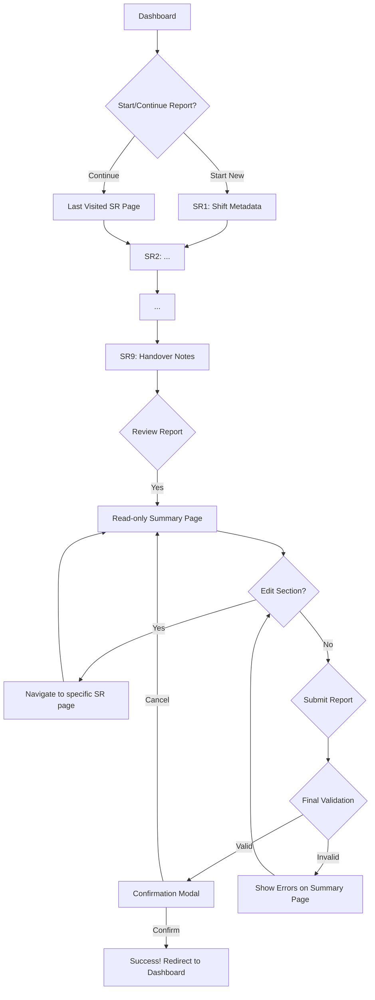

# UX Design Specification  
### Shift & KPI Reporting Solution  
**IBE160 – BMAD Phase: Validate UX Design**
---
## Table of Contents

- [UX Design Specification](#ux-design-specification)
    - [Shift \& KPI Reporting Solution](#shift--kpi-reporting-solution)
  - [**IBE160 – BMAD Phase: Validate UX Design**](#ibe160--bmad-phase-validate-ux-design)
  - [Table of Contents](#table-of-contents)
  - [1. Introduction](#1-introduction)
  - [2. Target Users \& Roles](#2-target-users--roles)
    - [2.1 Shift Leaders](#21-shift-leaders)
    - [2.2 Department Managers](#22-department-managers)
    - [2.3 Operations Manager](#23-operations-manager)
  - [3. Design Goals \& UX Principles](#3-design-goals--ux-principles)
    - [3.1 Design Goals](#31-design-goals)
    - [3.2 UX Principles](#32-ux-principles)
  - [4. Information Architecture](#4-information-architecture)
    - [4.1 Navigation Structure](#41-navigation-structure)
    - [4.2 Navigation Pattern](#42-navigation-pattern)
  - [5. Layout Specification](#5-layout-specification)
    - [5.1 Page Layout](#51-page-layout)
      - [Sidebar](#sidebar)
      - [Main Content](#main-content)
    - [5.2 Dashboard Layout](#52-dashboard-layout)
    - [5.3 Historical Layout](#53-historical-layout)
    - [5.4 Shift Report Layout (SR1–SR9)](#54-shift-report-layout-sr1sr9)
  - [6. Visual Identity \& Styling](#6-visual-identity--styling)
    - [6.1 Color Palette](#61-color-palette)
    - [6.2 Typography](#62-typography)
  - [7. Component Inventory](#7-component-inventory)
    - [7.1 Navigation](#71-navigation)
    - [7.2 KPI Cards](#72-kpi-cards)
    - [7.3 Tables](#73-tables)
    - [7.4 Forms](#74-forms)
    - [7.5 Buttons](#75-buttons)
    - [7.6 Alerts \& Messages](#76-alerts--messages)
  - [8. Interaction Design](#8-interaction-design)
    - [Buttons](#buttons)
    - [Forms](#forms)
    - [Navigation](#navigation)
  - [9. UX States](#9-ux-states)
    - [9.1 Loading](#91-loading)
    - [9.2 Empty State](#92-empty-state)
    - [9.3 Error State](#93-error-state)
    - [9.4 Success State](#94-success-state)
  - [10. UX Data Structure](#10-ux-data-structure)
    - [Dashboard KPIs](#dashboard-kpis)
    - [Historical Table](#historical-table)
    - [Shift Reports (SR1–SR9)](#shift-reports-sr1sr9)
  - [11. User Flows](#11-user-flows)
    - [Flow: Shift Registration](#flow-shift-registration)
    - [Flow: Manager KPI Analysis](#flow-manager-kpi-analysis)
  - [12. Non-Functional UX Requirements](#12-non-functional-ux-requirements)
    - [Performance](#performance)
    - [Usability](#usability)
    - [Accessibility](#accessibility)
  - [13. Constraints](#13-constraints)
  - [Appendix](#appendix)
    - [Related Documents](#related-documents)
    - [Core Interactive Deliverables](#core-interactive-deliverables)
    - [Optional Enhancement Deliverables](#optional-enhancement-deliverables)
    - [Next Steps \& Follow-Up Workflows](#next-steps--follow-up-workflows)
  - [14. Summary](#14-summary)

## 1. Introduction  
This UX Design Specification defines the visual structure, information architecture, interaction rules, and component system for the *Shift & KPI Reporting Solution*.  
It is based directly on the UX Design Direction prototype and extended with all BMAD-required elements.

The system supports:
- Efficient shift data entry (SR1–SR9)
- KPI dashboards for supervisors and managers
- Historical report filtering and export
- A modern, dark-mode-first UI

---

## 2. Target Users & Roles

### 2.1 Shift Leaders  
- Primary users  
- Register shift data daily  
- Complete SR1–SR9  
- Should be able to use the system without training  

### 2.2 Department Managers  
- Read access to reports  
- Use Dashboard and Historical pages  
- Filter by department, date, KPI  

### 2.3 Operations Manager  
- Full system access  
- Monitors KPIs and trends  
- Exports reports (Excel/CSV)

---

## 3. Design Goals & UX Principles

### 3.1 Design Goals  
- Clean and minimal dark UI  
- Clear visual hierarchy  
- KPI-first layout  
- Low cognitive load  
- Component-driven and scalable

### 3.2 UX Principles  
- **Consistency**: Unified component behavior  
- **Predictability**: Stable navigation and structured flows  
- **Clarity**: High contrast, modern typography  
- **Scalability**: Easy to expand with new pages  
- **Dark-mode First**: Optimized entire color system

**Interactive Mockups:**

- Design Direction Showcase Mockups from stich: [Mockup-Common-Layout.html](./stich/Mockup-Common-Layout.html)
- Design Direction Showcase Mockups from stich: [Mockup-Dashboard.html](./Mockup-Dashboard.html)
- Design Direction Showcase Mockups from stich: [Mockup-Historical.html](./stich/Mockup-Historical.html)
- Design Direction Showcase Mockups from stich: [Mockup-SR1.html](./Mockup-SR1.html)
- Design Direction Showcase Mockups from stich: [Mockup-SR2.html](./Mockup-SR2.html)
- Design Direction Showcase Mockups from stich: [Mockup-SR3.html](./Mockup-SR3.html)
- Design Direction Showcase Mockups from stich: [Mockup-SR4.html](./Mockup-SR4.html)
- Design Direction Showcase Mockups from stich: [Mockup-SR5.html](./Mockup-SR5.html)
- Design Direction Showcase Mockups from stich: [Mockup-SR6.html](./Mockup-SR6.html)
- Design Direction Showcase Mockups from stich: [Mockup-SR7.html](./Mockup-SR7.html)
- Design Direction Showcase Mockups from stich: [Mockup-SR8.html](./Mockup-SR8.html)
- Design Direction Showcase Mockups from stich: [Mockup-SR9.html](./Mockup-SR9.html)

---

## 4. Information Architecture

### 4.1 Navigation Structure

1. Common Layout  
2. Dashboard  
3. Historical  
4. Shift Report 1  
5. Shift Report 2  
6. Shift Report 3  
7. Shift Report 4  
8. Shift Report 5  
9. Shift Report 6  
10. Shift Report 7  
11. Shift Report 8  
12. Shift Report 9

### 4.2 Navigation Pattern  
- Persistent left sidebar  
- Active item highlighted (#223d49)  
- Clicking loads content into the main panel  

---

## 5. Layout Specification

### 5.1 Page Layout

#### Sidebar  
- Width: 72 (Tailwind)  
- Background: `#182c34`  
- Border: `#305869`  
- Vertical menu list  
- Hover + active states

#### Main Content  
- Responsive grid layout  
- 16–24px spacing  
- Cards and panels using dark content background  

### 5.2 Dashboard Layout  
- KPI cards at top  
- Trend/graph module in middle  
- Optional weekly comparison  

### 5.3 Historical Layout  
- Filter section at top  
- Large data table in middle  
- Summary KPIs at bottom  

### 5.4 Shift Report Layout (SR1–SR9)  
- Title  
- Form section  
- Next/Back buttons  
- Step-by-step validation  
- Linear progress flow

---

## 6. Visual Identity & Styling

### 6.1 Color Palette  
| Role | Hex | Description |
|------|------|-------------|
| Primary | #3abff8 | Accent color |
| Dark Background | #101d23 | Global background |
| Content Background | #182c34 | Cards, tables |
| Border | #305869 | Dividers |
| Text Primary | #ffffff | Headings, main text |
| Text Secondary | #8fb9cc | Labels |

### 6.2 Typography  
- Font: **Inter**  
- Headings: 700–900  
- Body text: 400  
- Secondary text: #8fb9cc  

---

## 7. Component Inventory

*Note: The primary component library for this project is **shadcn/ui**. The following inventory is based on components available from this library, with custom components specified where needed.*

### 7.1 Navigation  
- Sidebar  
- Menu links  
- Active/hover states

### 7.2 KPI Cards  
- Bold numbers  
- Secondary labels  
- Optional trend indicators

### 7.3 Tables  
- Dark theme  
- Hover: #223d49  
- Grid borders: #305869  

### 7.4 Forms  
- Inputs, dropdowns, date pickers  
- Tailwind Forms plugin  
- Focus border: #3abff8  

### 7.5 Buttons  
- Primary (blue)  
- Secondary (dark)  
- Disabled state  

### 7.7 Shift Report Stepper

**Purpose:** To visually guide the Shift Leader through the 9-step Shift Report process, indicating current, completed, and upcoming steps, making the process feel structured and manageable.

**Anatomy & Content:**
- **Layout:** Vertical sidebar stepper.
- **Indicators:** Step number (1, 2, 3...) for each step.
- **Titles:** Short, concise titles displayed next to the step number.
- **Status Indicators:**
    - Completed step: Checkmark icon.
    - Current step: Solid dot or distinct highlight.
    - Upcoming step: Hollow circle.

**States:**
- **Current Step:** Highlighted background with primary accent color for number/icon. Text is bold.
- **Completed Step:** Background changes to a subtle success color, checkmark icon appears, number/icon in a neutral color. Text is regular weight.
- **Upcoming Step:** Minimal styling, hollow circle icon, number/icon and text in secondary text color.

**Actions & Behavior:**
- **Navigation (Backward):** Users can click on any completed or current step to navigate back to that specific form page for review or data correction.
- **Navigation (Forward):** Moving to upcoming steps is guided and potentially restricted (e.g., "Next" button on form pages, or disabled stepper steps until current step is complete).
- **Hover:** Hovering over a step displays a tooltip with the full title/description of that step.

---

## 8. Interaction Design

### 8.1 Consistency Rules

#### Button Hierarchy

*   **Primary Action:**
    *   **Style:** Solid fill with the primary accent color (`#3abff8`).
    *   **Usage:** For the main success action on a page (e.g., "Submit Report", "Save Changes", "Next"). Use only **once** per view to avoid confusion.
*   **Secondary Action:**
    *   **Style:** Outline/ghost button (transparent background with a colored border) or a subtle dark background.
    *   **Usage:** For alternative, less-frequent actions (e.g., "Cancel", "Back", "Export").
*   **Tertiary/Subtle Action:**
    *   **Style:** Plain text link style.
    *   **Usage:** For non-critical actions, often within other components (e.g., "Edit" on a summary view, "Clear Filters").
*   **Destructive Action:**
    *   **Style:** Secondary style but with a red color (`#ff6b6b` or similar) to indicate a warning.
    *   **Usage:** For actions that delete data or have irreversible consequences (e.g., "Delete Report", "Remove User"). Always use with a confirmation dialog.

#### Feedback Patterns

*   **Success:**
    *   **Pattern:** A small, auto-dismissing "Toast" or "Sonner" notification at the bottom or top of the screen (e.g., "Report submitted successfully!"). Use `shadcn/ui`'s `Toast` component.
*   **Error:**
    *   **For Forms:** Inline error messages directly below the invalid field.
    *   **For System/API Errors:** A prominent, non-dismissing `Alert` component at the top of the relevant section (e.g., "Failed to load data. Please try again.").
*   **Loading State:**
    *   **For Pages/Sections:** Use `shadcn/ui`'s `Skeleton` component to show a grayed-out "ghost" version of the UI that is about to load.
    *   **For Buttons:** The button that triggered the action should show a spinner inside it and be disabled to prevent multiple clicks.
*   **Informational/Warning:**
    *   **Pattern:** A dismissible `Alert` component with a distinct color (e.g., yellow or blue) to provide helpful tips or warnings that don't block user action.

#### Form Patterns

*   **Label Position:**
    *   **Default:** Top-aligned labels (above the input field). This is generally best for scannability and allows for longer labels without impacting form width.
*   **Required Field Indicator:**
    *   **Pattern:** A subtle asterisk (`*`) next to the label for required fields.
*   **Validation Timing:**
    *   **Pattern:** On-blur validation (when the user leaves the field) for immediate feedback, and on-submit for a final check of the entire form.
*   **Error Display:**
    *   **Pattern:** Inline error messages directly below the input field, with a clear red text. A summary of errors at the top of the form for complex forms (if multiple errors).
*   **Help Text:**
    *   **Pattern:** Brief, contextual help text below the input field in a lighter text color. For more extensive help, a small info icon (i) next to the label that reveals a tooltip or popover on hover/click.

#### Modal Patterns

*   **Size Variants:**
    *   **Pattern:** Standard (default, for most confirmations/simple forms), Large (for complex forms, tables), and Full-Screen (for multi-step flows or detailed views on small screens).
*   **Dismiss Behavior:**
    *   **Pattern:** Can be dismissed by clicking outside the modal content area or by pressing the `Esc` key. Always include an explicit "Close" button (X icon) in the top-right corner, and a "Cancel" button in the footer for actions.
*   **Focus Management:**
    *   **Pattern:** The initial focus should automatically shift to the first interactive element inside the modal. Focus should be "trapped" within the modal while it's open, preventing interaction with the background content.
*   **Stacking:**
    *   **Pattern:** Avoid stacking multiple modals. If a new modal needs to be opened, the previous one should be dismissed first. For complex nested workflows, consider using multi-step forms within a single modal or dedicated pages instead.

#### Navigation Patterns

*   **Active State Indication:**
    *   **Pattern:** The currently active navigation item (in the sidebar) should have a distinct background highlight (e.g., `#223d49` as per current spec) and bold text to clearly differentiate it. A subtle border on the left side can also reinforce the active state.
*   **Breadcrumb Usage:**
    *   **Pattern:** Use breadcrumbs for multi-level hierarchical navigation to show the user's current location within the application. Display them prominently at the top of the main content area.
*   **Back Button Behavior:**
    *   **Pattern:** For most internal application navigation, the browser's back button behavior should be maintained. For specific workflows or modals, an in-app "Back" button should be provided, clearly indicating the previous logical step or view within that specific context.
*   **Deep Linking:**
    *   **Pattern:** Support deep linking for all major views and reports, allowing users to share direct URLs and maintain state across page reloads (e.g., dashboard with pre-selected date ranges).

#### Empty State Patterns

*   **First Use (Onboarding):**
    *   **Pattern:** When a section is empty for the first time (e.g., no shift reports submitted), display a friendly message explaining what the section is for, along with a clear Call-to-Action (CTA) to get started (e.g., "Welcome! Submit your first shift report here.").
*   **No Results (Search/Filter):**
    *   **Pattern:** When a search or filter yields no results, provide a clear message ("No results found for 'X'"), suggest alternative actions (e.g., "Try adjusting your filters," "Clear search"), and possibly link to relevant documentation or common tasks.
*   **Cleared Content:**
    *   **Pattern:** For sections that can be cleared (e.g., a "drafts" section), an empty state should confirm the cleared status and potentially offer an "Undo" option for a short period, if technically feasible.

#### Confirmation Patterns

*   **Delete/Irreversible Actions:**
    *   **Pattern:** Always use a modal confirmation dialog for any action that results in permanent data deletion or irreversible changes. The dialog should clearly state the consequence, require explicit confirmation (e.g., re-typing the item's name or clicking "Confirm Delete"), and provide a "Cancel" option.
*   **Leave Unsaved Changes:**
    *   **Pattern:** If a user attempts to navigate away from a form with unsaved changes, trigger a browser-level confirmation dialog (e.g., "You have unsaved changes. Are you sure you want to leave?"). Consider implementing auto-save functionality where appropriate to minimize this.

#### Notification Patterns

*   **Placement:**
    *   **Pattern:** Non-critical notifications (informational, success) appear as "toasts" at the top-right or bottom-right of the screen, fading out after a few seconds. Critical notifications (errors requiring immediate attention) appear as alerts at the top of the relevant section or page.
*   **Duration:**
    *   **Pattern:** Informational/Success notifications auto-dismiss after 3-5 seconds. Error/Warning notifications require manual dismissal.
*   **Stacking:**
    *   **Pattern:** Multiple toast notifications should stack vertically, pushing older ones up or down. A maximum of 3 visible at any time, with older ones implicitly dismissible to make room.
*   **Priority Levels:**
    *   **Pattern:** Use distinct colors and icons for different notification types: Green for Success, Red for Error, Yellow for Warning, Blue/Gray for Info.

#### Search Patterns

*   **Trigger:**
    *   **Pattern:** Search should trigger results instantly as the user types (live search) where performance allows. For heavier searches, a dedicated "Search" button can be used.
*   **Results Display:**
    *   **Pattern:** Live search results can appear in a dropdown list below the search bar. Full-page search results should be displayed on a dedicated search results page, offering filtering and sorting options.
*   **Filters:**
    *   **Pattern:** Filters for search results should be clearly visible and interactive, ideally placed in a sidebar or as a collapsible section above the results.
*   **No Results:**
    *   **Pattern:** Display a clear "No results found for '[query]'" message, along with suggestions to refine the query or adjust filters.

#### Date/Time Patterns

*   **Format (Display):**
    *   **Pattern:** Dates should be displayed in a human-readable, locale-aware format (e.g., "Dec 6, 2025" or "06.12.2025"). Relative timestamps (e.g., "2 hours ago", "yesterday") can be used for recent events, switching to absolute dates after a certain threshold.
    *   **Times:** Use 24-hour format (e.g., "14:30") unless user preferences dictate 12-hour.
*   **Timezone Handling:**
    *   **Pattern:** All dates and times should be stored as UTC in the backend. On the frontend, dates and times should be converted to the user's local timezone for display. User input should be converted to UTC before sending to the backend.
*   **Pickers:**
    *   **Pattern:** Use intuitive calendar-style date pickers for date selection. Time input can be a simple dropdown for hours/minutes or a dedicated time picker component.

### Buttons  
- Hover: darker tone  
- Active: strong outline  
- Disabled: 50% opacity  

### Forms  
- Focus: bright accent border  
- Error: red border + helper text  

### Navigation  
- Smooth transitions  
- Active bold text  

---

## 9. UX States

### 9.1 Loading  
- KPI skeletons  
- Table spinner  

### 9.2 Empty State  
- "No data available" panel  

### 9.3 Error State  
- Red alert banner  

### 9.4 Success State  
- Green confirmation message  

---

## 10. UX Data Structure

### Dashboard KPIs  
- Total Orders  
- Orders per Hour  
- Absence %  
- Staff Count  
- Productivity Score  

### Historical Table  
- Date  
- Department  
- Shift Type  
- Orders  
- Hours  
- Absence %  
- Deviations  

### Shift Reports (SR1–SR9)  
Examples:  
- SR1: Shift metadata  
- SR3: Hours  
- SR4: Absence reasons  
- SR5: Order data  
- SR7: Deviations  

---

## 11. User Flows

### Flow: Shift Registration  
1. Open SR1  
2. Fill fields  
3. Next → SR2  
4. Continue to SR9  
5. Submit  
6. Confirmation state  

### Flow: Manager KPI Analysis  
1. Open Dashboard  
2. Review KPIs  
3. Open Historical  
4. Filter by date/department  
5. Export Excel  

### Flow: Shift Report Completion & Submission Flow

*   **User Goal:** The Shift Leader wants to complete a full Shift Report in a structured, efficient, and error-resistant way.
*   **Primary User:** Shift Leader
*   **Entry Points:**
    *   Dashboard: "Start Shift Report" button
    *   Dashboard: "Continue Shift Report" button (if a report is in progress)

#### **Flow Steps:**

1.  **Initiation:**
    *   **User Action:** Clicks "Start Shift Report" or "Continue Shift Report".
    *   **System Response:** The application navigates to the first page of the Shift Report form (SR1) or the last visited page if continuing. A progress indicator (e.g., "Step 1 of 9") is clearly visible.

2.  **Data Entry (SR1-SR9):**
    *   **User Action:** Fills out the form fields for each step (SR1 through SR9). Uses "Next" and "Back" buttons to navigate between form pages.
    *   **System Response:**
        *   Input data is validated in real-time (e.g., checking for valid numbers, required fields).
        *   Errors are displayed inline next to the corresponding field.
        *   The "Next" button may be disabled until all required fields on the current page are valid.
        *   All data is auto-saved as the user moves between steps.

3.  **Review Before Submission:**
    *   **User Action:** After completing the final step (SR9), clicks a "Review Report" button.
    *   **System Response:** The system presents a single, read-only summary page displaying all entered data from SR1-SR9, organized by section. Each section has an "Edit" button.
    *   **User Action (Optional):** Clicks an "Edit" button for a specific section.
    *   **System Response (Optional):** Navigates the user back to the corresponding form page (e.g., SR3) to allow for corrections. After editing, the user is returned to the review page.

4.  **Submission:**
    *   **User Action:** Clicks the "Submit Final Report" button on the review page.
    *   **System Response:**
        *   The system performs a final, comprehensive validation of the entire report.
        *   A confirmation modal appears: "Are you sure you want to submit this report? It cannot be edited after submission."

5.  **Confirmation/Error Handling:**
    *   **User Action:** Clicks "Confirm" in the modal.
    *   **System Response (Success):**
        *   The report is submitted.
        *   A success message is displayed: "Shift Report Submitted Successfully!"
        *   The user is redirected to the Dashboard.
        *   The submitted report is now visible to Managers.
    *   **System Response (Error):**
        *   If final validation fails, the confirmation modal closes, and an error message appears at the top of the review page, listing the specific errors and providing links to the sections that need correction (e.g., "Error in Shift Hours section: Total hours exceed 24.").

#### **Mermaid Flowchart:**

---

## 12. Responsive Design & Accessibility Strategy

### 12.1 Responsive Design Strategy

This outlines how the application's layout and content will adapt across various screen sizes, adopting a mobile-first approach.

*   **Breakpoint Strategy:**
    *   **`sm` (640px):** Small screens (large phones in landscape)
    *   **`md` (768px):** Medium screens (tablets)
    *   **`lg` (1024px):** Large screens (small laptops)
    *   **`xl` (1280px):** Extra-large screens (desktops)
    *   **`2xl` (1536px):** Double extra-large screens
*   **Adaptation Patterns:**
    *   **Navigation:**
        *   **Mobile/Tablet (`sm`, `md`):** Left sidebar collapses into a hamburger menu or bottom navigation bar.
        *   **Desktop (`lg`+):** Persistent left sidebar.
    *   **Dashboard Layout:**
        *   **Mobile/Tablet:** KPI cards stack vertically. Graphs may simplify or offer horizontal scrolling.
        *   **Desktop:** Multi-column layout for KPI cards and graphs.
    *   **Tables:**
        *   **Mobile/Tablet:** Tables will prioritize critical columns, with less important data either hidden, available via horizontal scroll, or converted to a card-view layout per row.
        *   **Desktop:** Full-width, multi-column tables.
    *   **Forms (SR1-SR9):**
        *   **Mobile/Tablet:** Single-column layout. The `ShiftReportStepper` will adapt to provide clear progress indicators suitable for smaller screens.
        *   **Desktop:** Multi-column layouts where appropriate.
    *   **Modals:**
        *   **Mobile:** Modals will automatically convert to full-screen sheets or dedicated pages.
        *   **Desktop:** Standard centered modal behavior.

### 12.2 Accessibility Strategy

Making the application usable for everyone, including individuals with disabilities, is a core principle.

*   **Compliance Target:**
    *   **WCAG 2.1 Level AA**.
*   **Key Requirements:**
    *   **Color Contrast:** Minimum contrast ratio of 4.5:1 (or 3:1 for large text).
    *   **Keyboard Navigation:** All interactive elements reachable and operable via keyboard, with visible focus indicators.
    *   **ARIA Labels:** Meaningful `aria-label` attributes for complex UI components.
    *   **Alt Text:** Descriptive `alt` text for all meaningful images.
    *   **Form Labels:** Properly associated labels (`<label for="...">`).
    *   **Error Identification:** Clear, descriptive error messages programmatically associated with input fields.
    *   **Touch Target Size:** Minimum 44x44px for interactive elements on mobile.
*   **Testing Strategy:**
    *   **Automated Tools:** Axe DevTools, Lighthouse.
    *   **Manual Testing:** Keyboard-only navigation.
    *   **Screen Reader Testing:** With common screen readers (e.g., NVDA, VoiceOver).

## 13. Constraints
- Tailwind CSS
- Tailwind Forms plugin
- Dark mode only
- Fully compatible with React/Next.js

---
## Appendix

### Related Documents

- Product Requirements: [PRD-md](./PRD.md)
- Product Brief: [product-brief.md](./product-brief.md)
- Proposal: [proposal.md](proposal.md)
- Brainstorming: [bmad-shiftapp-inegration-and-proposal-alignment-rune-2025-10-29.md](./Fase%20O/bmad-shiftapp-lean-integration-and-proposal-alignment-Rune-2025-10-29.md)
- Brainstorming: [brainstorming-BMAD-AI-feedback-userflow-review-rune-2025-10-27.md](./Fase%20O/brainstorming-BMAD-AI-feedback-userflow-review-Rune-2025-10-27.md)
- Brainstorming: [brainstorming-data-entry-risk-thomas.md](./Fase%20O/Brainstorming-data-entry-risk-thomas.md)
- Brainstorming: [brainstorming-userflow-thomas.md](./Fase%20O/brainstorming-userflow-thomas.md)
  
  
### Core Interactive Deliverables

This UX Design Specification was created through visual collaboration:

- **Color Theme Visualizer**: C:\Users\thbje\Documents\IBE160\SG-Ostfold\docs\ux-color-themes.html
  - Interactive HTML showing all color theme options explored
  - Live UI component examples in each theme
  - Side-by-side comparison and semantic color usage

- **Design Direction Mockups**: [ux-design-directions.html](./ux-design-directions.html)
  - Interactive HTML with 6-8 complete design approaches
  - Full-screen mockups of key screens
  - Design philosophy and rationale for each direction

### Optional Enhancement Deliverables

_This section will be populated if additional UX artifacts are generated through follow-up workflows._

<!-- Additional deliverables added here by other workflows -->

### Next Steps & Follow-Up Workflows

This UX Design Specification can serve as input to:

- **Wireframe Generation Workflow** - Create detailed wireframes from user flows
- **Figma Design Workflow** - Generate Figma files via MCP integration
- **Interactive Prototype Workflow** - Build clickable HTML prototypes
- **Component Showcase Workflow** - Create interactive component library
- **AI Frontend Prompt Workflow** - Generate prompts for v0, Lovable, Bolt, etc.
- **Solution Architecture Workflow** - Define technical architecture with UX context

## 14. Summary  
This document provides a **complete professional UX Design Specification**, including:
- Layout
- Components
- User flows
- Interaction rules
- States
- Data structure
- Accessibility
- Constraints

Fully ready for BMAD: *Validate UX Design*.

